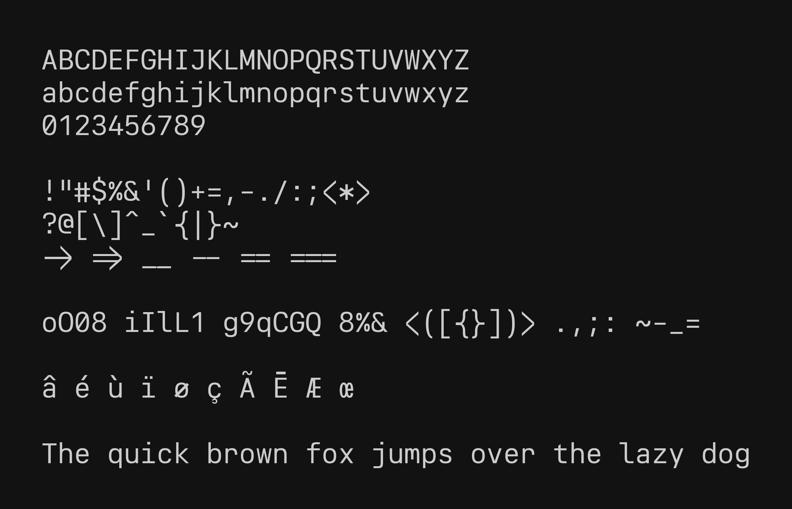

A compact neo-grotesk font designed for coding.

## Philosophy

I'm very passionate about the font I am using for my terminal and overall neovim experience, and I couldn't find the "perfect" font. So I decided to design one from scratch using python. This font aims to bring some elements from the all time classic "Univers" font into the proportions of the "JetBrains Mono" font. The name "Nordwand" is a reference to switzerland and its iconic typography – bringing it into the stiff and cold atmosphere of the swiss north faces.

Amongst the inspirations for the design, you might identify:

- Univers from Adrian Frutiger
- SF Pro & SF Mono from Apple
- Alpes Mono from Sharp Type
- Ubuntu Mono from Dalton Maag

## Compile your own custom version

This font is generated with python. Each glyph is drawn from a python glyph class, in which you can inject a drawing context object. You can for example modify some metrics like the x-height, the capital height etc.

To do so, override the config.example.yml with the values of your liking. Be sure to visualize the individual glyphs with `python -m visualize --config config.yml <glyph_id>`. Then you can geneate the full font with `python -m generate_font --config config.yml`. The font files will be generated inside `./custom-fonts`.

> [!WARNING]
> There are no guarantees that the font might look good with different metrics, and some glyphs might require some tweaking if the metrics are altered !

## Minimal Ligatures

I personally do not enjoy ligatures that much, but still appreciate the simple ones such as "->", "--", or "\_\_" so I decided to ship the font with a minimal set of ligatures that still allow an easy spotting of the individual characters.

## Characters

## Samples

### Python

### C++

### Haskell

