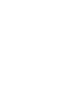
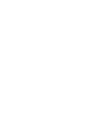
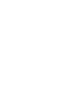

# Alternative Characters

<!-- Generated by `python -m scripts.alternatives_markdown`. -->

| Feature | Character | Code point | Default | Alternative | Alternative glyph |
| --- | --- | --- | --- | --- | --- |
| `cv01=1` | `0` | `U+0030` |  |  | `zero_slashed` |
| `cv02=1` | `y` | `U+0079` |  |  | `lowercase_y_2` |
| `cv03=1` | `l` | `U+006C` |  |  | `lowercase_l_2` |
| `cv04=1` | `i` | `U+0069` |  |  | `lowercase_i_2` |
| `cv05=1` | `k` | `U+006B` |  |  | `lowercase_k_2` |
| `cv06=1` | `a` | `U+0061` |  |  | `lowercase_a_2` |
| `cv07=1` | `e` | `U+0065` |  |  | `lowercase_e_2` |
| `cv07=1` | `v` | `U+0076` |  |  | `lowercase_v_2` |
| `cv08=1` | `w` | `U+0077` |  |  | `lowercase_w_2` |
| `cv09=1` | `x` | `U+0078` |  |  | `lowercase_x_2` |
| `cv10=1` | `z` | `U+007A` |  |  | `lowercase_z_2` |
| `cv11=1` | `f` | `U+0066` |  |  | `lowercase_f_2` |
| `cv12=1` | `m` | `U+006D` |  |  | `lowercase_m` |
